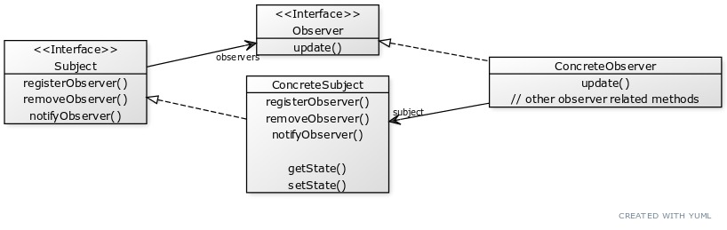

## Chapter 2

### Observer Pattern
Defines a **one-to-many** (one subject, many observers)
dependency between objects so that when one object
changes state; all of its dependents are notified
and updated automatically.\
_Supposedly the most commonly used pattern._\
_Real World Example: Subscription with a publisher
(subject) and subscribers (observers)_

### Principles to know
- Strive for loosely coupled designs between objects
  that interact.

Other Notes:
- **Loose coupling**
    - Means there is a minimized interdependency between objects.
    - The only thing the subject knows about an observer
      is that it implements a certain interface (the Observer interface),
      It does not need to know anything about the concrete class.
    - New observers can be added at any time.
    - We never need to modify the subject to add new observers.
    - We can reuse subjects or observers independently of each other.
    - Changes to either the subject, or an observer will
      not affect the other.
- How many kinds of change can be identified here?

### Other things we learned from this chapter:
- Subjects update Observers using a common interface
- Observers of any concept type can participate in the pattern
  as long as they implement the Observer interface.
- Observers are loosely coupled in that the Subject
  knows nothing about them, other than that they implement
  the Observer interface.
- You can push or pull data from the Subject when using
  this patter (pull is more "correct").
- Swing makes heavy use of the Observer Patter, as do
  many GUI frameworks.
- This pattern exists in many other places, including
  RxJava, JavaBeans, and RMI, as well as other language
  frameworks, like Cocoa, Swift, and JavaScript events.
- The Observer Pattern is related to the Publish/Subscribe
  Pattern, which is for more complex situations with
  multiple Subjects and/or multiple message types.
- The Observer Pattern is a commonly used pattern, and
  will be viewed again with the Model-View-Controller.

Q: Based on our first implementation, which of the following applies?
- [x] A. We are coding to create implementations, not interfaces.
- [x] B. For every new display, we will need to alter the code.
- [x] C. We have no way to add/remove display elements at runtime.
- [ ] D. The display elements don't implement a common interface.
- [x] E. We haven't encapsulated the part that changes.
- [ ] F. We are violating encapsulation of the WeatherData class.