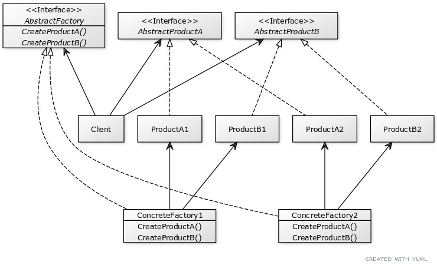

## Chapter 4

### Factory Method Pattern
Defines an interface for creating an object, but lets subclasses decide
which class to instantiate. Factory Method lets a class defer
instantiation to subclasses.

### Abstract Factory Pattern
Provides an interface for creating families of related or dependent
objects without specifying their concrete classes.

### Principles to know
- Depend upon abstractions. Do not depend upon concrete classes.
    - Not necessarily "Program to an interface, not an implementation",
      but also suggests high-level components shouldn't depend on
      low-level components; rather they both depend on abstractions.
    - Guidelines (to strive for, not strictly follow):
        - No variable should hold a reference to a concrete class.
        - No class should derive from a concrete class.
        - No method should override an implemented method of its base classes.

### Other things we learned from this chapter:
- In design patterns, the phrase “implement an interface” does NOT
  always mean “write a class that implements an interface, by using the
  ‘implements’ (Java) keyword in the class declaration.” In the general
  use of the phrase, a concrete class implementing a method from a
  supertype (which could be a abstract class OR interface) is still
  considered to be “implementing the interface” of that supertype.
- A <u>factory method</u> handles object creation and encapsulates it
  in a subclass. This decouples the client code in the superclass
  from the object creation code in the subclass.
- `abstract Product factoryMethod(String type);`
    - A factory method is abstract, so the subclasses are counted on to
      handle object creation.
    - A factory method returns a <u>Product</u> that is typically used
      within methods defined in the superclass.
    - A factory method isolates the <u>Client</u> (the code in the
      superclass, like orderPizza()) from knowing what kind of concrete
      Product is actually created.
    - A factory method may be parameterized (or not) to select among
      several variations of a product.
- Factory Method Pattern has Creator classes and Product classes:
    - Creator classes cover both abstract and concrete classes. The
      abstract creator class defines an abstract factory methods that
      the concrete creator subclasses implement to produce products.
      Often the creator contains code that depends on an abstract product,
      which is produced by a subclass. The creator never really knows
      which concrete product was produced.
    - Product classes cover both abstract and concrete classes. An
      abstract factory may reference an abstract product class, but the
      concrete factory will instantiate a concrete product to the
      abstract property.
- Products must implement the same interface so that the classes that
  use the products can refer to the interface, not the concrete class.
- Creator is a class that contains the implementations for all the
  methods to manipulate products, except for the factory method.
- The abstract factoryMethod() is what all Creator subclasses must
  implement.
- ConcreteCreator implements the factoryMethod(), which is the method
  that produces products.
- ConcreteCreator is responsible for creating one or more concrete
  products. It is the only class that has the knowledge of how to
  create these products.
- Often, methods in an Abstract Factory are implemented as factory
  methods.
- Factory Method creates objects through interfaces, while Abstract
  Factory does it through object composition

### Bullet Points
- All factories encapsulate object creation.
- Simple factory, while not a bona fide design pattern, is a simple way
  to decouple clients from concrete classes.
- Factory Method relies on inheritance: object creation is delegated to
  subclasses, which implement the factory method to create objects.
- Abstract Factory relies on object composition: object creation is
  implemented in methods exposed in the factory interface.
  _ All factory patterns promote loose coupling by reducing the dependency
  of your application on concrete classes.
- The intent of Factory Method is to allow a class to defer instantiation
  to its subclasses.
  _ The intent of Abstract Factory is to create families of related objects
  without having to depend on their concrete classes.
- The Dependency Inversion Principle guides us to avoid dependencies on
  concrete types and to strive for abstractions.
- Factories are a powerful technique for coding to abstractions, not
  concrete classes.