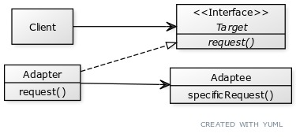
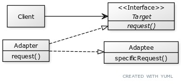
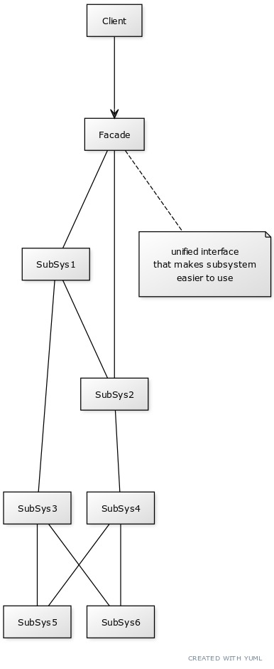

## Chapter 7

### Adapter Pattern
Converts the interface of a class into another interface the clients expect.
Adapter lets classes work together that couldn't otherwise because of compatible
interfaces.

### Facade Pattern
Provides a unified interface to a set of interfaces in a subsystem. Facade defines
a higher-level interface that makes the subsystem easier to use.

### Principles to know
- Talk only to your immediate friends.
    - This means only invoke methods that belong to; the object itself, objects
      passed in as a parameter of a method, any object the method creates or
      instantiates, or any components of the object.
    - Often referred to as the Principle of Least Knowledge (Law of Demeter).
    - Pros:
        - reduces dependencies between objects
        - reduces software maintenance
    - Cons:
        - results in more wrapper classes to handle method calls to other components.
        - increased complexity and development time
        - decreased runtime performance

### Bullet Points
- When you need to use an existing class and its interface is not the one you need,
  use an adapter.
- When you need to simplify and unify a large interface or complex set of interfaces,
  use a facade.
- An adapter changes an interface into one a client expects.
- A facade decouples a client from a complex system.
- Implementing an adapter may require little work, or a great deal of work depending
  on the size and complexity of the target interface.
- Implementing a facade requires that we compose the facade with its subsystem and
  use delegation to perform the work of the facade.
- There are two forms of the Adapter Pattern: object and class adapters. Class
  adapters require multiple inheritance.
- You can implement more than one facade for a subsystem.
- An adapter wraps an object to change its interface, a decorator wraps an object
  to add new behaviors and responsibilities, and a facade "wraps" a set of objects
  to simplify.
