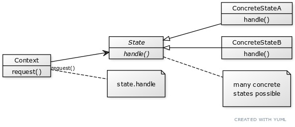

## Chapter 10

### State Pattern
Allows an object to alter its behavior when its
internal state changes. The object will appear
to change its class.

### Bullet Points
- The State Pattern allows an object to have many
  behaviors that are based on its internal state.
- Unlike a procedural state machine, the State Pattern
  represents each state as a full-blown class.
- The Context gets its behavior by delegating to the
  current state object it is composed with.
- By encapsulating each state into a class, we localize
  any changes that will need to be made.
- The State and Strategy Patterns have the same class 
  diagram, but they differ in intent.
- The Strategy Pattern typically configures Context 
  classes with a behavior or algorithm. It is like an
  flexible alternative to subclassing.
- The State Pattern allows a Context to change its behavior
  as the state of the Context changes. It is like an
  alternative to putting a lot of conditionals in your
  context.
- State transitions can be controlled by the State 
  classes or by the Context classes.
- Using the State Pattern will typically result in a
  greater number of classes in your design.
- State classes may be shared among Context instances.

Q: Which of the following describe the state of our implementation?
- [x] This code certainly isn’t adhering to the Open
  Closed Principle.
- [x] This code would make a FORTRAN programmer proud.
- [x] This design isn’t even very object-oriented.
- [x] State transitions aren’t explicit; they are buried 
  in the middle of a bunch of conditional statements.
- [x] We haven’t encapsulated anything that varies here.
- [x] Further additions are likely to cause bugs in 
  working code.