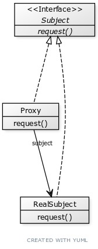
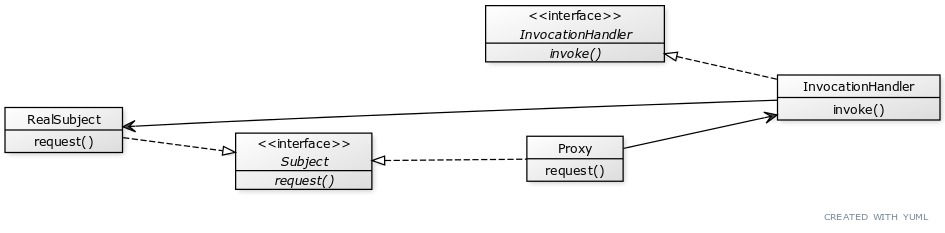

## Chapter 11

### Proxy Pattern
Provides a surrogate or placeholder for another object
to control access to it.

### Types of Proxy Patterns:
#### Remote Proxy
Manages interaction between a client and a remote object.
Acts as a _local representation to a remote object_.

#### Virtual Proxy
Controls access to a resource (object) that is 
expensive to create/instantiate.
#### Protection Proxy
Controls access to the methods of an object based
on access rights of the caller.

#### Firewall Proxy
Controls access to a set of network resources,
protecting the subject from "bad" clients.
#### Smart References Proxy
Provides additional actions whenever a subject
is referenced, such as counting the number of
references to an object.
#### Caching Proxy
Provides temporary storage for results of operations
that are expensive. It can also allow multiple clients
to share the results to reduce computation or
network latency.
#### Synchronization Proxy
Provides safe access to a subject from multiple threads.
#### Complexity Hiding Proxy
Hides the complexity of the controls access to a complex
set of classes. This is sometimes called the Facade Proxy.
The Complexity Hiding Proxy differs from the Facade Pattern
in that the proxy controls access while the Facade Pattern
just provides an alternative interface.
### Bullet Points
- The Proxy Pattern provides a representative for
  another object in order to control the client’s 
  access to it. There are a number of ways it can 
  manage that access.
- Many other variants of the Proxy Pattern exist
  including caching proxies, synchronization proxies,
  firewall proxies, copy-on-write proxies, and so on.
- Proxy is structurally similar to Decorator, but the
  two patterns differ in their purpose.
- The Decorator Pattern adds behavior to an object, 
  while Proxy controls access.
- Java’s built-in support for Proxy can build a
  dynamic proxy class on demand and dispatch all calls
  on it to a handler of your choosing.
- Like any wrapper, proxies will increase the number 
  of classes and objects in your designs.
